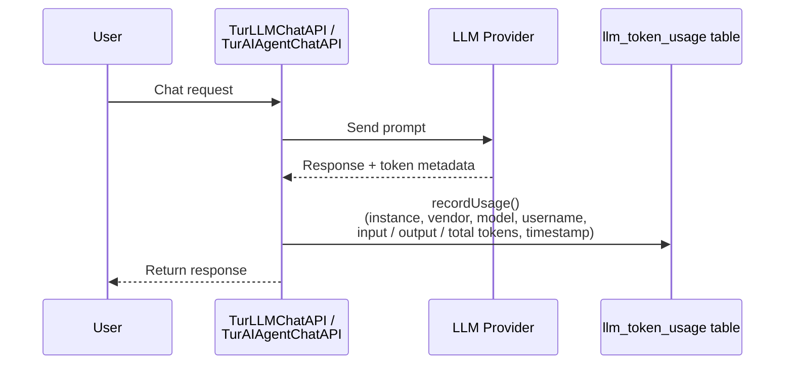

# Token Usage

The **Token Usage** page (`/token-usage`) gives administrators a clear view of how many tokens are being consumed by the LLM integrations — broken down by model, day, and month. This is the primary tool for tracking AI costs and identifying heavy usage patterns.

:::info Availability
This page only appears in the sidebar when **at least one LLM instance is enabled**. If no LLM is configured, the Generative AI section will not show Token Usage.
:::

---

## Period Selector

At the top of the page, a month navigator lets you move forward and backward through calendar months. All cards and tables update instantly when the period changes.

```
◀  January 2025  ▶
```

---

## Summary Cards

Four cards provide an at-a-glance snapshot of the selected month:

| Card | Description |
|---|---|
| **Total Requests** | Number of LLM API calls made during the period |
| **Input Tokens** | Total tokens sent to the model (prompts, context, system messages) |
| **Output Tokens** | Total tokens received from the model (generated responses) |
| **Total Tokens** | Sum of input + output tokens |

Values are displayed in a human-readable format — for example `1.2M`, `45K`, or `8.3K` — rather than raw numbers.

---

## Summary by Model

A monthly aggregation table grouping consumption by LLM instance:

| Column | Description |
|---|---|
| **Instance** | The LLM instance name as configured in Administration |
| **Vendor** | Provider (e.g., OpenAI, Anthropic, Google, Azure, Ollama) |
| **Model** | Specific model identifier (e.g., `gpt-4o`, `claude-3-5-sonnet`) |
| **Requests** | Total requests to this instance in the period |
| **Input** | Total input tokens for this instance |
| **Output** | Total output tokens for this instance |
| **Total** | Combined token count for this instance |

Use this table to compare token consumption across different providers and models, and to identify which instances account for the largest share of usage.

---

## Daily Breakdown

A day-by-day table showing consumption per model across the selected month:

| Column | Description |
|---|---|
| **Date** | Calendar day |
| **Instance** | LLM instance name |
| **Vendor** | Provider |
| **Model** | Model identifier |
| **Input Tokens** | Tokens sent that day |
| **Output Tokens** | Tokens received that day |
| **Total Tokens** | Combined token count for that day |
| **Requests** | Number of requests on that day |

Days with no LLM activity do not appear in the table. This breakdown helps spot daily spikes — for example, a batch re-indexing job or a high-traffic event.

---

## How Token Recording Works

Turing ES records token usage automatically on every LLM call — no extra configuration is needed.



**What gets recorded on each call:**

| Field | Description |
|---|---|
| Instance | Which LLM instance handled the request |
| Vendor | Provider name |
| Model | Model identifier from the response metadata |
| Username | The authenticated user who triggered the call |
| Input Tokens | Extracted from the LLM response metadata |
| Output Tokens | Extracted from the LLM response metadata |
| Total Tokens | Input + output |
| Timestamp | Date and time of the request |

:::note
Responses where all token counts are zero are **not recorded**. This filters out failed or incomplete LLM calls that would skew usage statistics.
:::

---

## API Endpoint

Token usage data is also available via the REST API:

```
GET /api/v2/llm/token-usage?month=YYYY-MM
```

Returns both the monthly summary (aggregated by model) and the daily breakdown for the requested month.

**Example:**

```bash
curl "http://localhost:2700/api/v2/llm/token-usage?month=2025-01" \
  -H "Key: <YOUR_API_TOKEN>"
```

---

*Previous: [Chat](./chat.md)*
