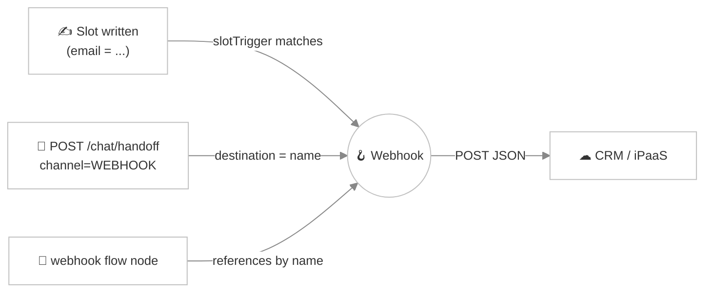

# Webhooks

> *A visitor finishes a lead-capture conversation. Their name, company, and email are sitting in slots. What you really want is for that lead to land in Salesforce — automatically, the moment it's complete, without anyone copy-pasting. **Webhooks** are how Turing reaches out to the rest of your stack.*

A **webhook** in Viglet Turing ES is an admin-declared outbound HTTP call. When something interesting happens in a conversation — a slot gets filled, a visitor is handed off, a flow reaches a node — Turing `POST`s a JSON payload (the conversation's slots, optionally the transcript) to a URL you configure. The receiver is almost always a CRM (Salesforce, HubSpot, Pipedrive) or an automation platform (Zapier, Make, n8n), but it can be any HTTP endpoint you control.

Webhooks are **deployment-wide**, not per-agent: you define one `push-to-salesforce` webhook and every agent and flow can use it. Manage them in the console under **Chat Webhooks**.

---

## Three ways a webhook fires

A single webhook entity supports three firing modes. Which one applies is decided by the **slot trigger** field and by how the webhook is referenced.



| Mode | When it fires | How you set it up |
|---|---|---|
| **Slot subscription** | Automatically, the instant a matching slot is written through any slot-write path | Set **slot trigger** to a slot name (e.g. `email`) or the wildcard `*` (any slot) |
| **Handoff channel** | Explicitly, when the conversation calls `POST /chat/handoff` with `channel=WEBHOOK` and `destination=<webhook name>` | Leave **slot trigger** blank — this makes the webhook "handoff-only" |
| **Flow node** | Deterministically, when a [Chat Flow](./chat-flow.md) reaches a `webhook` node that references it by name | Add a `webhook` node to a flow; failures can route a `failure` edge when the node opts into `continueOnFailure` |

The slot-subscription path is the most common: the dispatcher watches the slot event bus, **edge-detects** changes, and fires the moment your trigger slot changes value — no flow authoring required.

---

## Creating a webhook

In the console, open **Chat Webhooks → New** and fill in:

1. **Name** — stable, unique, admin-visible. It must start with a letter or underscore and contain only letters, digits, `_`, `-`, or `.`. This name is also the handoff `destination`.
2. **Target URL** — the absolute `http(s)` URL the payload is sent to.
3. **HTTP method** — `POST` (default), `PUT`, `PATCH`, `GET`, or `DELETE`. Body-bearing methods (`POST`/`PUT`/`PATCH`) send the payload; `GET`/`DELETE` send headers only.
4. **Slot trigger** — a slot name, `*` for any slot, or blank for handoff-only (see the table above).
5. **Include slots** — an optional comma-separated whitelist of slot names to put in the payload. Blank includes every non-internal slot. Use this to avoid leaking PII you don't need to send.
6. **Custom headers** — a JSON object of extra request headers, e.g. `{"X-Api-Key":"abc","X-Source":"turing"}`.
7. **Auth header** — an `Authorization` value such as `Bearer xyz` (see [Security](#security)).
8. **Payload template** — an optional JSON body shaped to your CRM's schema (see [Payload templates](#payload-templates)).
9. **Signing secret** / **Signature header** — optional HMAC signing (see [Security](#security)).
10. **Enabled** — toggle the webhook on/off without deleting it.

---

## The default payload

When you don't supply a payload template, Turing sends a default **envelope**:

```json
{
  "event": "slot_write",
  "webhook": "push-to-salesforce",
  "conversationId": "8f3c…",
  "slot": "email",
  "slots": {
    "name": "Ada Lovelace",
    "company": "Analytical Engines",
    "email": "ada@example.com"
  }
}
```

| Field | Present when | Meaning |
|---|---|---|
| `event` | always | `slot_write` (auto), `handoff` (explicit), or `flow_node` (flow node) |
| `webhook` | always | the webhook's name |
| `conversationId` | always | the conversation that triggered the call |
| `slot` | slot-write only | the slot name that fired the trigger |
| `transcript` | handoff only | a rendered transcript snapshot |
| `slots` | always | the slot map, after the **include slots** whitelist is applied |

---

## Payload templates

If your receiver expects its own JSON shape (most CRMs do), provide a **payload template** and Turing will send that verbatim instead of the envelope. Use `{{slot}}` placeholders — they're substituted with the slot's value:

```json
{
  "properties": {
    "email": "{{email}}",
    "firstname": "{{name}}",
    "company": "{{company}}"
  }
}
```

Placeholder values are **JSON-escaped** before substitution, so a slot containing quotes, newlines, or other special characters can't corrupt the resulting JSON. Unknown or empty slots resolve to an empty string. This is exactly the body HubSpot's contacts API, for example, expects — so you can point a webhook straight at it.

---

## Security

Two independent, optional layers protect a webhook call. Both secrets are **write-only**: the admin form posts them in plaintext, Turing encrypts and stores them via `TurSecretCryptoService`, and reads never echo them back — the UI shows only a "configured" indicator. Submitting a blank value on update **keeps the stored secret** (so you can edit the URL without re-typing credentials).

### Authentication header

The **auth header** is a full `Authorization` value (e.g. `Bearer xyz`) attached to every call. If you also set a custom `Authorization` in **custom headers**, that one wins. If the stored credential can't be decrypted (e.g. after a key rotation), Turing sends the call *unauthenticated* rather than dropping it — the receiver is expected to reject it.

### HMAC signing

Set a **signing secret** and Turing adds a signature header — `X-Turing-Signature` by default, or whatever **signature header** name you choose — computed as:

```
<signature header>: sha256=<hex of HMAC-SHA256(secret, raw request body)>
```

The signature is computed over the **exact bytes** put on the wire, so your receiver can verify the call genuinely came from this Turing instance. Verify it like this (Node.js):

```js
const expected = "sha256=" + crypto
  .createHmac("sha256", SIGNING_SECRET)
  .update(rawBody)            // the raw request body, before JSON.parse
  .digest("hex");
const ok = crypto.timingSafeEqual(Buffer.from(expected), Buffer.from(req.header("X-Turing-Signature")));
```

Signing only applies to body-bearing methods — `GET`/`DELETE` carry no body and are never signed. Leave the signing secret blank for the legacy unsigned behaviour.

---

## Reliability

Every dispatch goes through the shared `viglet-core` webhook dispatcher with a bounded **retry/back-off policy**: **3 attempts**, a 10-second per-attempt read timeout, and ~2-second linear back-off. A flaky receiver is retried rather than dropped on the first blip.

Failure handling differs by mode, by design:

- **Handoff** surfaces the final failure to the caller — the visitor clicked "send to CRM" and deserves to know whether it worked.
- **Slot-write** swallows the failure (it's logged, never propagated): a flaky CRM must never break a live chat turn.
- **Flow node** returns the outcome to the engine, so a node with `continueOnFailure: true` can route its `failure` edge.

---

## REST API

All endpoints require admin (`ROLE_ADMIN`) or the matching `AI_AGENT_*` authority and live under `/api/genai/webhook`.

| Method | Path | Purpose |
|---|---|---|
| `GET` | `/api/genai/webhook` | List all webhooks (secrets redacted) |
| `GET` | `/api/genai/webhook/{id}` | Get one webhook |
| `POST` | `/api/genai/webhook` | Create a webhook |
| `PUT` | `/api/genai/webhook/{id}` | Update a webhook |
| `DELETE` | `/api/genai/webhook/{id}` | Delete a webhook |

Reads return `authHeader: null` + `hasAuthHeader: true|false` and `signingSecret: null` + `hasSigningSecret: true|false` — the secrets themselves are never sent back.

:::note Multi-tenancy
Webhooks are scoped by `tenantId`. In a multi-tenant deployment each tenant sees and fires only its own webhooks. See [Multi-tenancy](./multi-tenancy.md).
:::

---

## Worked examples

**HubSpot — create/update a contact on `email`:** slot trigger `email`, target the HubSpot contacts API, auth header `Bearer <private-app-token>`, and the payload template shown [above](#payload-templates).

**Salesforce / Pipedrive — push a completed lead at handoff:** leave the slot trigger blank, end your flow with a "send to CRM" step that calls `POST /chat/handoff` with `channel=WEBHOOK` and `destination=push-to-salesforce`. The `transcript` is included so the rep has context.

**Zapier / Make — fan out to anything:** point the target URL at a Zapier "Catch Hook" or Make "Custom webhook" trigger and let the no-code platform route to Sheets, Slack, email, or hundreds of other apps. Add a signing secret and verify it in a filter step for tamper-proofing.

---

## Related pages

- [Chat Flow](./chat-flow.md) — the `webhook` node and the slots that feed webhook payloads
- [Routines](./routines.md) — the other async integration primitive (`scheduleAgent`)
- [AI Agents](./ai-agents.md) — where conversations and slots originate
- [Multi-tenancy](./multi-tenancy.md) — per-tenant webhook isolation
