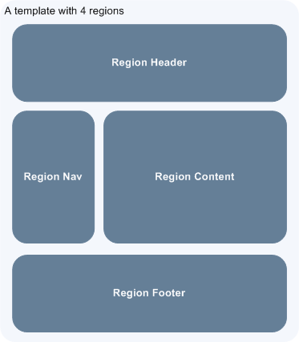
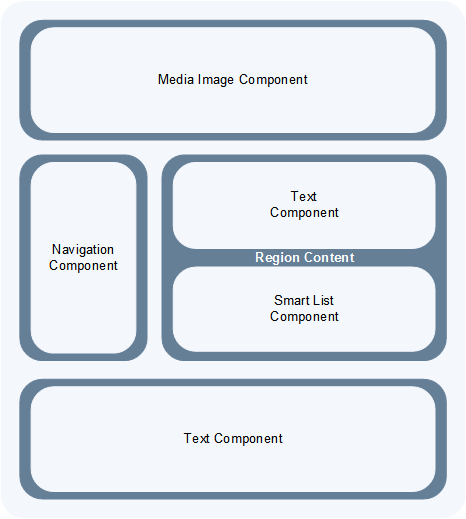

= Viglet Shio CMS: Developer Guide
Viglet Team <opensource@viglet.com>
:page-layout: documentation
:organization: Viglet Shio CMS
ifdef::backend-pdf[:toc: left]
:toclevels: 5
:toc-title: Table of Contents
:doctype: book
:revnumber: 0.3.8 
:revdate: 06-08-2021
:pdf-theme: viglet
:pdf-themesdir: {docdir}/../themes/
:page-breadcrumb-title: Developer Guide
:page-permalink: /docs/shio/developer-guide/
:imagesdir: ../../
:page-pdf: /docs/shio/shio-developer-guide.pdf
:page-product: shio

:numbered:
== Introduction
This chapter provides concepts and other information required to perform Shio CMS development tasks.

Include the following topics:

* <<About the Shio CMS>>
* <<What will be covered in this book>>
* <<Necessary documentation>>

=== About the Shio CMS

Viglet Shio CMS allows administrators and contributors to use a graphical interface to define how content is presented on web sites. The **Themes** area is where presentation objects are managed. **View Page** shows the page completely rendered.

There are 2 types of site views: **Management** and **Published**, where:

* **Management**: Contains all content on the site, both published and unpublished and drafts
* ** Published**: Site that displays only published content. It is necessary to publish the contents for them to be displayed.

The Shio CMS has example Page Layouts and Regions, which can be viewed when the site is created, and can serve as a starting point for creating your site. In addition, there are ways to programmatically develop and customize these templates, which we will discuss in this document.

==== Page Layouts and Regions

A Page Layout is a basic building block for creating and managing pages using repeated patterns. Each page generated is associated with exactly one Page Layout, which controls the layout, theme and regions on the page.

The basic purpose of the presentation is to display folders and contents from the Shio CMS repository as web pages. At this point, you need to associate folders and content with Page Layouts.

A single template can be applied to various folders and content, which greatly facilitates the process of development and management of the website and allows for a consistent appearance and characteristics.

The minimum model is to have a single Page Layout for all Folders and another Page Layout for all content. Many customer sites have multiple Page Layouts and can be built using between three and ten templates. Carefully the Page Layouts are planned and it results in an easier development and makes it easier to maintain your site (s).

A region is an area of ​​the page where the content is rendered. Models are organized into regions. The regions can be defined as curly or not. For example, a content region may be specialized in presenting content, such as header and footer regions that are never changed and repeated between Page Layouts and thus defined as Cacheada. And the non-cached regions are defined in the Page Layout specific to each presentation.

[#page-layout-4-regions]
.Shows a template with four regions.

==== API for Components

In Page Layots and Regions you can have API for Components, which are responsible for being able to render different types of content sources from the Shio CMS repository. For example, a **Query Component** can be used to filter a list of contents in a folder, while a **Navigation Component** can render folders as menus on your website.

[#page-layout-components]
.Page Layout with Component API in your regions.

The hierarchical structure of this template and its regions with Component API is as follows:

.Page Layout
Header Region:: Navigation Component
Navigation Region:: Navigation Component
Content Region:: Query Component
Footer Region:: Navigation Component

NOTE: The header is optional.

=== O que será coberto neste livro

Na tabela abaixo, resume os tópico que serão cobertos neste documento e como eles são aplicados no desenvolvimento do Shio CMS.
.Tópicos neste Livro
|===
|Tópico |Veja...

|Entendendo como as aplicações são deployadas
|"Arquitetura de Deploy" na página 17

|Use Javascript para controlar como o conteúdo será exibido na página ou em uma região
|"Usando Renderizadores Customizados" na página 35

"Desenvolvendo Display Views", na página 42

"Desenvolvendo Layouts de Região", na página 58

"Desenvolvendo Page Layouts", na página 67

| Use CSS, Javascript, AJAX e tecnologias relacionadas para aplicar um tema em uma pasta ou em um conteúdo.
| "Desenvolvendo Temas", na página 71

"Ativando Renderização de AJAX JSP", na página 139

| Entendendo a tag library do Shio CMS
| "Personalizando o Shio CMS" na página 73

"Usando a Tag Library do Shio CMS" na página 75

| Opcional. Desenvolva grids e estilos personalizados
| "Personalizando o Shio CMS" na página 73

 "Usando a Tag Library do Shio CMS" na página 75

 "Criando um Grid Personalizado" na página 77

 "Criando Estilos e Tipos de Estilos" na página 79

"Exemplos de Grid e Estilo personalizado" na página 79

"Implementando Grid, Tipos de Estilo e Estilos" página 88

|Opcional. Desenvolver Tipos de Componentes de Conteúdo
| "Tipo de Componente de Conteúdo" página 91

| Consulte o Javadoc para tópicos não cobertos neste livro (como usando cache e desenvolvimento modificadores de request)
| Shio CMS <version> Public API Javadocs

| Construa e deploye suas aplicação
| "Construindo e Deployando Aplicações/Extensões" página 131
|===

=== Documentações necessárias
Para outras documentações sobre o Shio CMS, incluindo Javadoc, Javascript API, vá em Getting Started (https://shio.readme.io/docs).

== Arquitetura de Implementação
Neste capítulo descreve e ilustra aplicações, componentes e arquivos que são implementados com o Shio CMS incluindo os seguintes tópicos:

* <<Visão Geral>>
* <<Diagrama de Implementação>>
* <<Tabela de Deploy>>
* <<Explicação do Diagrama e da Tabela>>

=== Visão Geral

Para personalizar o Shio CMS, você deve implementar Java Archive (JAR) nas seguintes localizações:

=== Tabela de Deploy
|===
|Diretório |Arquivo implementado |Quem provê

|<SHIO_DIR>/
|viglet-shio.jar
|Shio

|<SHIO_DIR>/
|viglet-shio.conf
|Você
|===

=== Explicação do Diagrama e da Tabela

==== viglet.shio.jar
Este arquivo JAR é implementado quando você instala e configura o Shio CMS. 

==== viglet-shio.conf
O arquivo viglet-shio.conf especifica configurações do Shio CMS, podendo especificar variáveis e ajustes da JVM. O Shio CMS é baseado no Spring Boot 2, portanto todas as configurações presentes esta solução são validas. Mais informações em: https://docs.spring.io/spring-boot/docs/current/reference/html/deployment.html#deployment-script-customization-when-it-runs[Customizing a Script When It Runs, window="_blank"]

== Features

=== General

==== Search Ready
Contents are indexed automatically. This way, you can use embedded search engine in your site. Simple and powerful.

====  Native Cache
Your site will be optimized with native cache. Faster and hassle free.

====  Pure Javascript
Entire development use directly themes using Javascript language. No deploy, just create and ready.

====  Microservices
Run Multi-container Docker applications using Docker Compose, integrating with Nginx, MariaDB and MongoDB.

=== Databases
Supports all databases supported of Spring Framework as:

* H2
* MySQL
* Oracle

=== On Install
* Import the Sample Site using sample-site repository
* Create a Stock Site using stock-site-import repository
* Import the Post Types
* Create admin user using the password: admin

=== Version Control
* Use the Github to create a version of object.

=== Publishing

* When is created a post, its status will be **Draft**.
* If the post was saved and it was published, it will appear on Site and its status will be **Published**.
* If the post is published, but the post was changed, its status will be **Stale**.
* If the post is unpublished will disappear on Site and its status will be **Unpublished**.

=== GraphQL
Allows access the Content using GraphQL

=== Modeling
Create new Post Types with different attributes, that fit your business.

==== Post Type
* Define the Name, Description and Identifier for Post Type
* Define how will responsible for publishing, that will receive a email always that Post of Post Type is published.

==== Fields
* Order the Fields of Post Type
* Create a Text, Decription and Identifier for each Field
* Define if the Field is Tite and/or Description of Post Type.

===== Search Navigation
Define how the content will be index into Viglet Turing

* Search Field Association: Use default fields of Viglet Turing Semantic Navigation
* Create Addtional Search Field: Use a custom field of Viglet Turing Semantic Navigation, can choose the same name of field or other.

=== Configuration Console

==== Auth Providers
Define how the can be the authentication of Console:

* Shio Native
* OpenText Directory Service

==== Exchange Providers
Define the provider can be import content to Shio CMS. It is possible many instances of same provider.
Supports the following Providers, 

===== OTCS - OpenText Content Services
Import Documents from OTCS

===== OTMM - OpenText Media Management
Import Files from OTMM

==== Search Providers
Define how the Search of Site will work.

==== Email
Configure the Email Service to send email for Notification.

=== Users
Allow create, modify or delete a user that can access the console or protect page of site.
Associate the user to Groups

=== Groups 
Allow create, modify or delete a groups and add user into groups

=== Administration
* Reorder the posts into folder and show the results instantly into page of site.
* Generate spreadsheet of folder, where each sheet is a Post Type.
* Download the site
* Import Site
* Create Site with theme pre-defined
* Create worflow
* Create folders
* Create post types
* Create posts
* Upload multiple files into folder
* Change Folder View: List or Thumbnail
* Navigate between folders through breadcrumb
* Preview of Site using button "View Site"
* See all commits changes of site

==== Permissions

===== Console
Define Permission of Console, adding Groups and Users

===== Page
Define Permission of Pages of Site, adding Groups and Users

==== Protected Page
Through Page Permission the Site allow Protected Page, with Users defined on Administration Page

==== Properties of Site
* Name
* Description
* URL
* Define the Association between Post Type and Page Layout
* Define what content will be searchable
* Define which Folder will be save posts of Form when the result be success.

====  Search
* Search global
* Search posts per folder

====  Order the list of objects of folder per:
** Name
** Description
** Date

====  Select objects of folder per:
** Content
** Folder
** Everything
** Invert Selection
** Nothing

==== Popup action on mouse over of Folder as:
** Edit
** Copy
** Move
** Clone
** Delete
** View Page
** Clear Cache

==== Popup action on mouse over of Post as:
** Copy
** Move
** Clone
** Delete
** View Page
** Clear Cache

==== Select multiple objects and define an actions as:
** Copy
** Move
** Delete

=== Post Types

System Post Types as: 

==== Text
==== Photo
==== Video
==== Quote
==== Link
==== File
==== Region
==== Theme
==== Page Layout
==== Alias
==== Folder Index

=== Field Types

Create complex custom Post Types using many Field Types:

==== Hidden
==== Text
==== Text Area
==== Ace Editor - HTML
==== Ace Editor - Javascript
==== HTML Editor
==== Content Select
==== Relator
==== Combo Box
==== Recaptcha
==== Form Configuration
==== Date
==== Multi Select
==== Tab
==== Check Box

== Criando Page Layouts
Neste capítulo descreve os tipos de Page Layout e explica com um template é construído. Incluem os seguintes tópicos:

* <<Javascript>>
* <<Desenvolvendo Regiões>>

=== Javascript
O Javascript é permitido ser utilizada em Page Layout e Region. Provendo as seguintes funcionalidades.

* **Suporta bibliotecas Javascript** - Usato para incluir qualquer arquivo de Javascript personalizado  para usar no código Javascript.
* **Código Javascript** - Usado no server-side, ou seja para ser processado pelo servidor, que irá no final retornar uma renderização para a view. No código voc&e pode consturir um objeto Javascript e usar o código do HTML para gerar a renderização.
* **Código HTML** - Usado para separar a renderização, que pode ser usado no campo do Código Javascript para gerar a renderização para a view.

As views de Javascripts precisam ser escritas em Javascript usando a bibliotecas Javascript do Viglet Shio, pode ser utilizado especificando o **shObject** em seu código. Mais informaçõesm no Javascript API (https://shiocms.github.io/shio/javascript/) 

=== Desenvolvendo Regiões
Shio CMS prove um número pré-configurado de componentes( como Navigation Component, Query Component) que simplifica a construção de uma página web.
Cada região pode chamar um ou mais componentes.

O resultado final da região é cacheada, ao menos que time-to-live (TTL) esteja configurado para zero (0).

==== Para que uma Região é utilizada
Regiões são essencialmente um fragmento de renderização. O desenvolvedor web associa a região ao um Page Layout ou outra Região para criar o resultado final pretendido.

==== Utilizando URL de Imagens e Conteúdos
Quando está escrevendo uma região, se o componente contem um atributo com link ou media, as informações armazenadas são apenas IDs que precisam ser convertidos para URLs.
Pode ser utilizado usando os seguintes métodos do shObject:

* generateFolderLink(id) - Gera link de uma Pasta
* generatePostLink(id) - Gera link de Post ou Arquivo
* generateObjectLink(id) - Gera link de qualquer objeto, podendo ser Pasta, Post ou Arquivo

[glossary]
== Glossário

[glossary]
book:: livro, documento